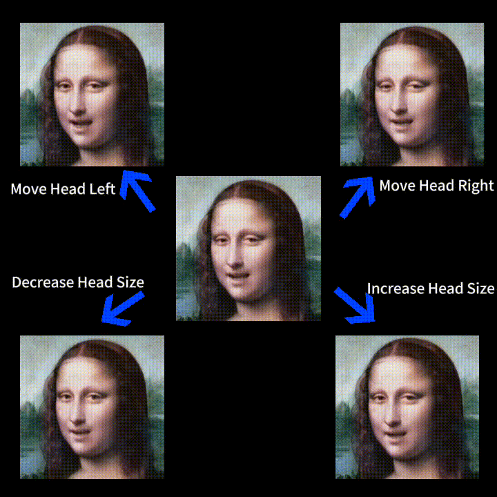

## More scripts



## Adjust face location and face scale

```
python ./code/demo.py \
    --infer_type 'mfcc_full_control' \
    --stage1_checkpoint_path 'ckpts/stage1.ckpt' \
    --stage2_checkpoint_path 'ckpts/stage2_more_controllable.ckpt' \
    --test_image_path 'test_demos/portraits/monalisa.jpg' \
    --test_audio_path 'test_demos/audios/english_female.wav' \
    --result_path 'results/monalisa_case4/' \
    --control_flag True \
    --seed 0 \
    --pose_yaw 0.1 \
    --pose_pitch 0 \
    --pose_roll 0 
    --face_location 0.5 \
    --face_scale 0.4
```


### Adjust head location to the left

```
python ./code/demo.py \
    --infer_type 'mfcc_full_control' \
    --stage1_checkpoint_path 'ckpts/stage1.ckpt' \
    --stage2_checkpoint_path 'ckpts/stage2_more_controllable.ckpt' \
    --test_image_path 'test_demos/portraits/monalisa.jpg' \
    --test_audio_path 'test_demos/audios/english_female.wav' \
    --result_path 'results/monalisa_case5/' \
    --control_flag True \
    --seed 0 \
    --pose_yaw 0.1 \
    --pose_pitch 0 \
    --pose_roll 0 \
    --face_location 0.4 \
    --face_scale 0.4
```

### Adjust head location to the right

```
python ./code/demo.py \
    --infer_type 'mfcc_full_control' \
    --stage1_checkpoint_path 'ckpts/stage1.ckpt' \
    --stage2_checkpoint_path 'ckpts/stage2_more_controllable.ckpt' \
    --test_image_path 'test_demos/portraits/monalisa.jpg' \
    --test_audio_path 'test_demos/audios/english_female.wav' \
    --result_path 'results/monalisa_case6/' \
    --control_flag True \
    --seed 0 \
    --pose_yaw 0.1 \
    --pose_pitch 0 \
    --pose_roll 0 \
    --face_location 0.6 \
    --face_scale 0.4
```


### Adjust head to larger scale

```
python ./code/demo.py \
    --infer_type 'mfcc_full_control' \
    --stage1_checkpoint_path 'ckpts/stage1.ckpt' \
    --stage2_checkpoint_path 'ckpts/stage2_more_controllable.ckpt' \
    --test_image_path 'test_demos/portraits/monalisa.jpg' \
    --test_audio_path 'test_demos/audios/english_female.wav' \
    --result_path 'results/monalisa_case7/' \
    --control_flag True \
    --seed 0 \
    --pose_yaw 0.1 \
    --pose_pitch 0 \
    --pose_roll 0  \
    --face_location 0.5 \
    --face_scale 0.6
```


### Adjust head to smaller scale

```
python ./code/demo.py \
    --infer_type 'mfcc_full_control' \
    --stage1_checkpoint_path 'ckpts/stage1.ckpt' \
    --stage2_checkpoint_path 'ckpts/stage2_more_controllable.ckpt' \
    --test_image_path 'test_demos/portraits/monalisa.jpg' \
    --test_audio_path 'test_demos/audios/english_female.wav' \
    --result_path 'results/monalisa_case8/' \
    --control_flag True \
    --seed 0 \
    --pose_yaw 0.1 \
    --pose_pitch 0 \
    --pose_roll 0  \
    --face_location 0.5 \
    --face_scale 0.2
```


Regarding face location and face scale, please be aware that only minor adjustments can be made. Broad adjustments may impact other facial movements, such as the movements of the lips. This limitation is primarily because during data processing, we ensured that the face is centered and scaled to a certain proportion as much as possible, as detailed in the [facial cropping code](https://github.com/liutaocode/talking_face_preprocessing?tab=readme-ov-file#facial-part-cropping). Consequently, the network has limited capability for extensive adjustments in terms of angle.

If you require significant changes in these attributes, you may consider reprocessing the training data. For instance, you could allow a wider range of movement and adjust the camera distance to a larger extent. By doing so, the network will be exposed to more diverse data during training, enabling it to handle more substantial variations in face location and scale.